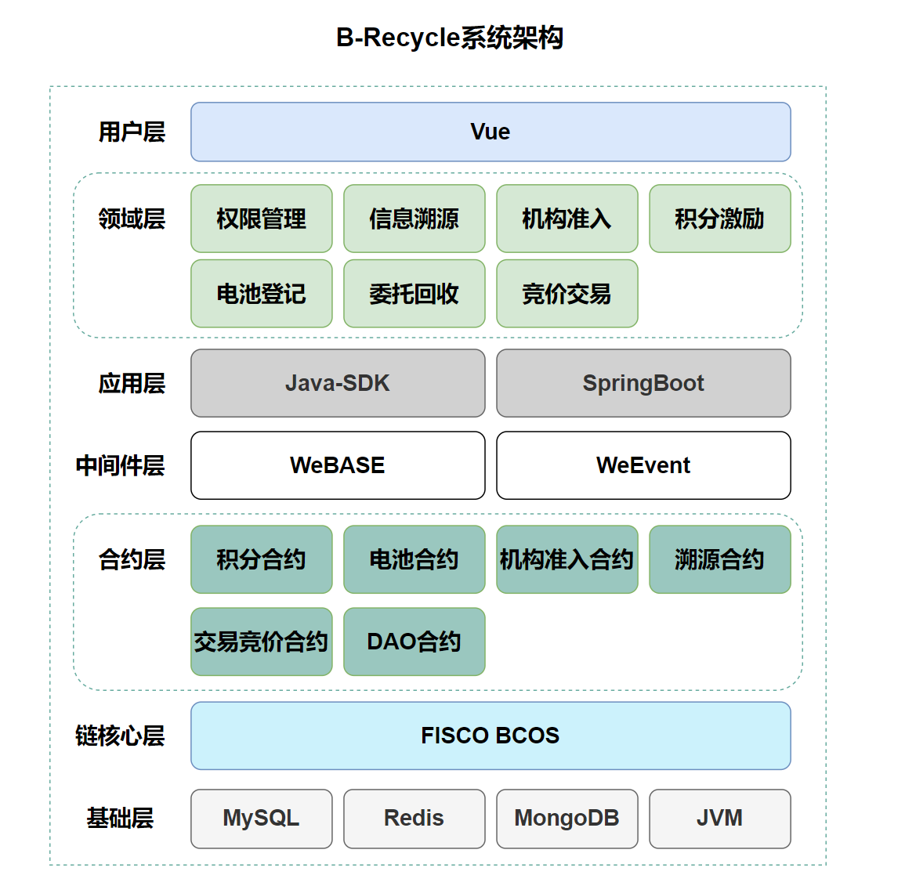
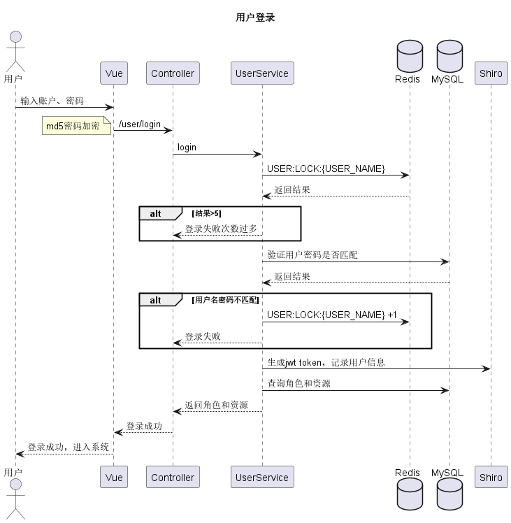
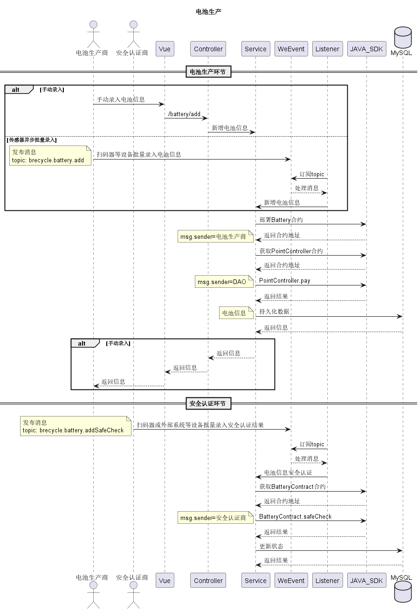
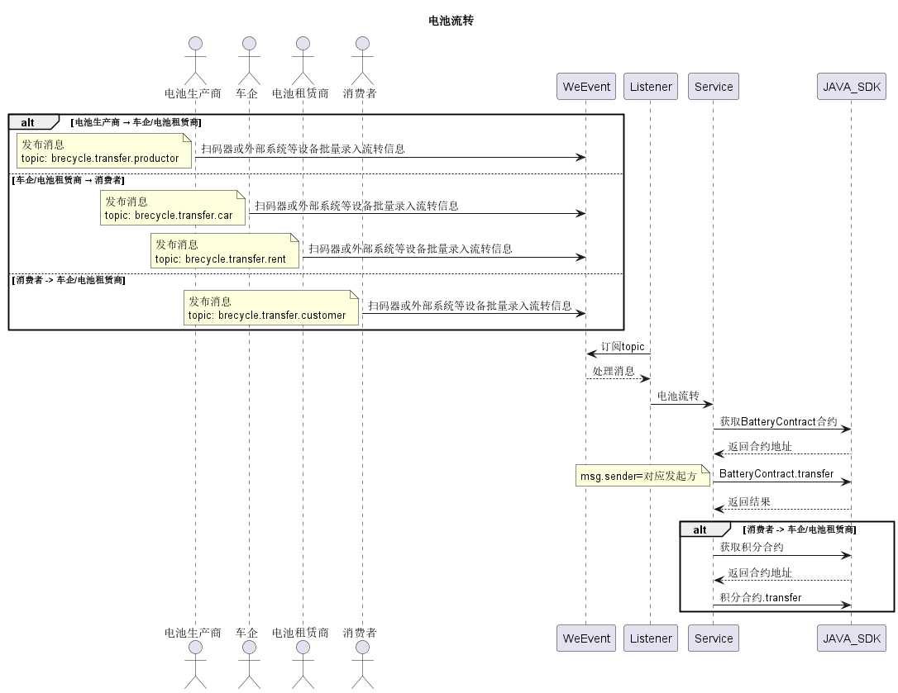
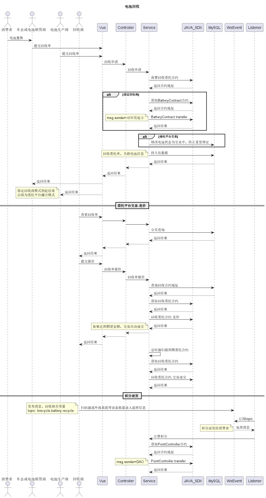
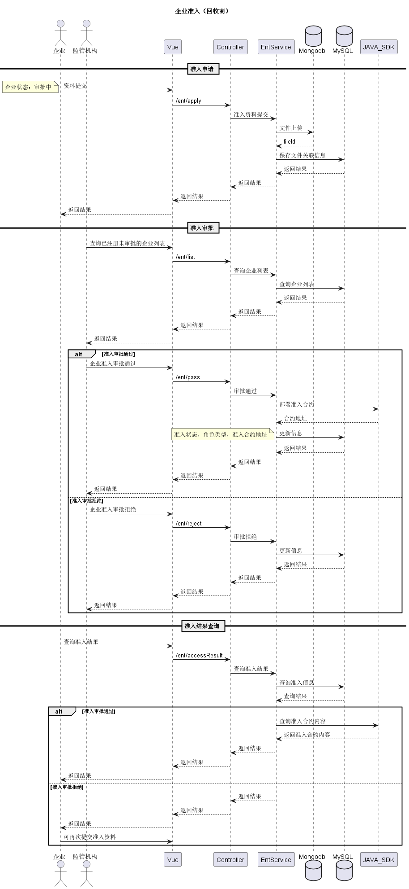
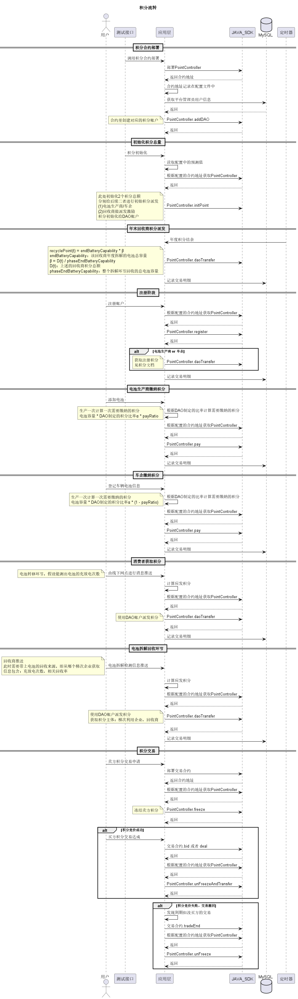

# B-Recycle Battery Recycle Platform

## Architecture
B-Recycle a battery recycle platform which is base on FISCO BCOS. We use Vue+SpringBoot
to build our frontend and backend, plunge in Java-SDK which is provided by FISCO BCOS. 
We also use WeEvent, a blockchain based message queue.

project architecture:
```
-- B-Recycle
    |-- contract
    |-- docs
    |-- front
    |-- script
    `-- server
```
- contract: solidity contract
- docs: Sequence diagram or other .puml files
- front: Vue project 
- script: SQL script
- server: SpringBoot based project 

## dependency
- Nodejs
- OpenJDK 12+
- FISCO BCOS blockchain core sever
- WeEvent message broker server
- MySQL
- MongoDB
- Redis

## Configuration
### Java server
`server/src/main/resources/application.yml`
```
# initial port is 8090
server:
  port: 8090

spring:
  ……
  datasource:
    # MySQL related config
    url: jdbc:mysql://localhost:3306/brecycle?useUnicode=true&characterEncoding=UTF-8&useJDBCCompliantTimezoneShift=true&useLegacyDatetimeCode=false&serverTimezone=UTC
  ……
  redis:
    # Redis related config
    database: 0
    host: 127.0.0.1
    ……
    port: 6379
  data:
    # Mongodb related config
    mongodb:
      host: 127.0.0.1
      port: 27017
      database: brecycle
……
# copy FISCO BCOS's nodes cert in relative path
fisco:
  cryptoMaterial:
    certPath: "conf"
    caCert: "conf/ca.crt"
    sslCert: "conf/sdk.crt"
    sslKey: "conf/sdk.key"
# FISCO BCOS nodes list
  network:
    peers:
    - "192.168.111.128:20201"
    - "192.168.111.128:20200"
……

# WeEvent config
weevent:
  # WeEvent broker server url
  brokerUrl: "http://192.168.111.128:8091/weevent-broker"
……

point:
  ……
  # pointController contract addr
  pointController: "0xbb4ae196c032c53ce856289acb76c36771e8a74e"
```
configuration spec：
1. server port：server.port
2. MySQL url：spring.datasource:url
3. Redis connection：spring.redis.host/port/database
4. MongoDB connection：spring.data.mongodb.host/port/database
5. Fisco BCOS cert and nodes list
6. WeEvent broker server url: weevent.brokerUrl
7. pointController contract addr: point.pointController

### front server
`front/.env.serve-dev`
```
# java server url
VITE_APP_PROXY_URL = 'http://localhost:8090/'
```

## System Architecture


## key business sequence diagram
### user regist


### user login


### battery produce


### battery transfer


### battery recycle


### enterprise access


### point transfer
