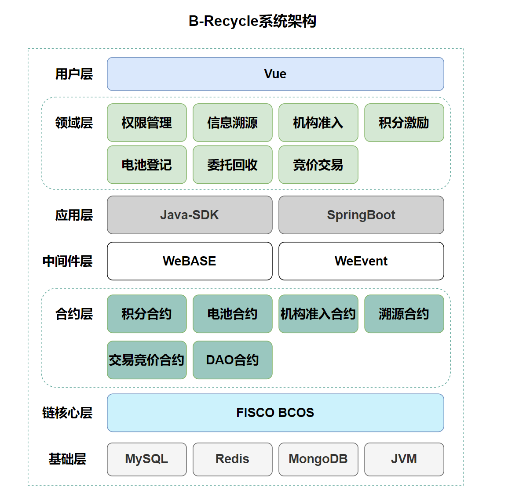
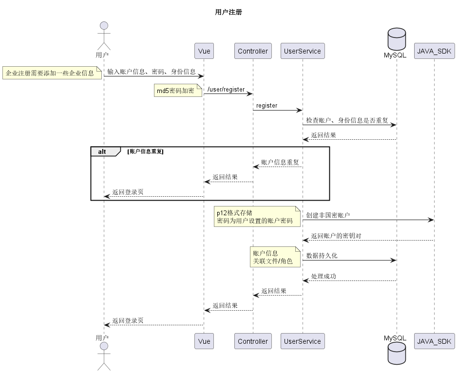
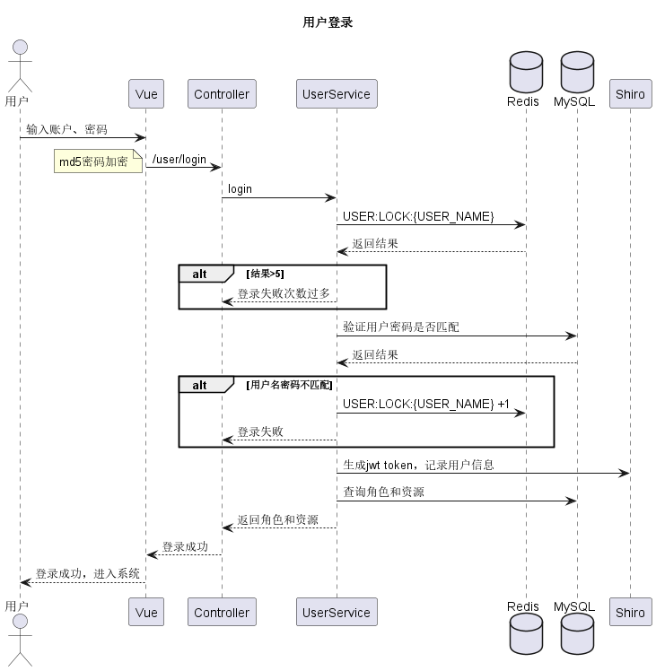
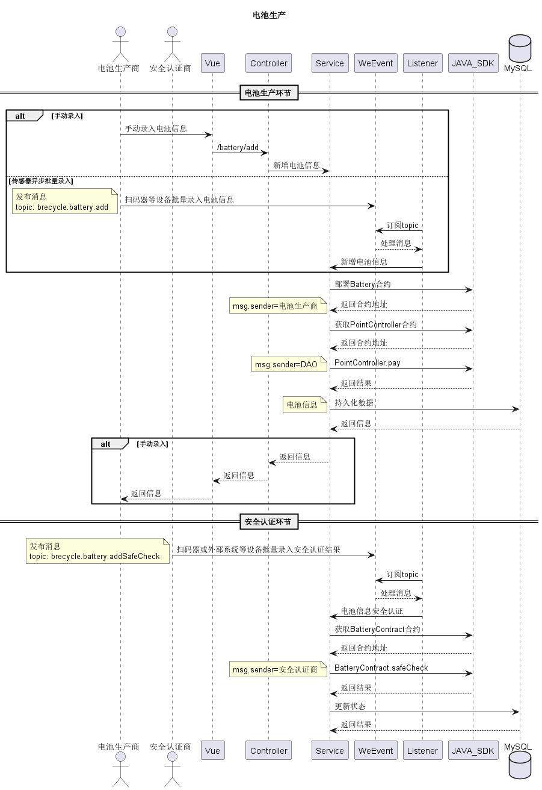
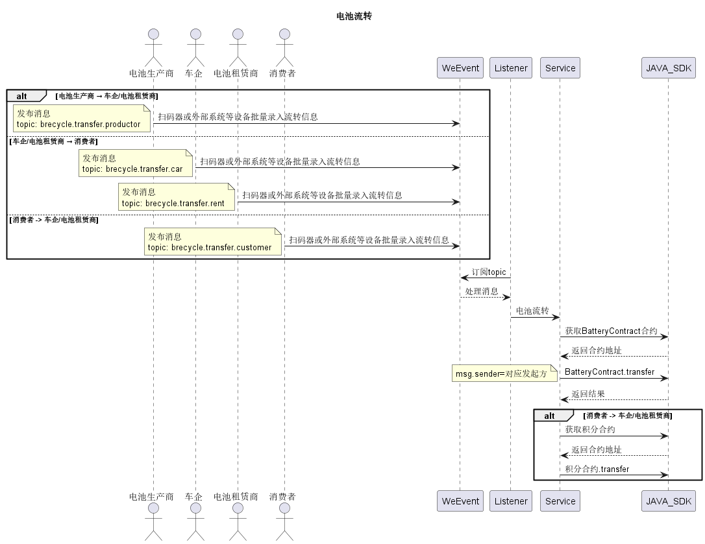
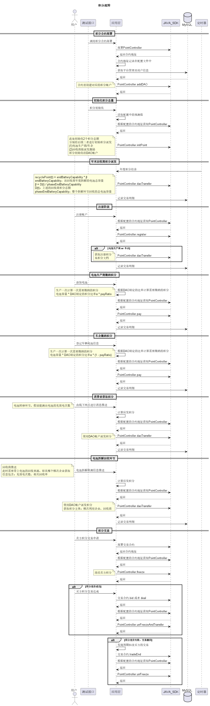

# B-Recycle电池回收管理平台
[English](https://github.com/cmgun/B-Recycle/blob/main/README-en.md)

[解决方案](Solution.md)

## 项目结构说明
B-Recycle是一个基于FISCO BCOS的区块链电池回收管理平台。该平台使用了Vue+SpringBoot 
进行前后端搭建，集成了FISCO BCOS的Java-SDK、区块链消息中间件WeEvent。

项目结构如下：
```
-- B-Recycle
    |-- contract
    |-- docs
    |-- front
    |-- script
    `-- server
```
其中：
- contract为solidity合约
- docs为流程图等puml文件
- front为Vue前端工程 
- script为脚本
- server为SpringBoot后端服务

## 依赖要求
- Nodejs
- OpenJDK 12+
- FISCO BCOS链核心服务
- WeEvent区块链消息队列
- MySQL
- MongoDB
- Redis

## 配置说明
### 后端配置
`server/src/main/resources/application.yml`
```
# 默认启动端口8090
server:
  port: 8090

spring:
  ……
  datasource:
    # MySQL相关配置
    url: jdbc:mysql://localhost:3306/brecycle?useUnicode=true&characterEncoding=UTF-8&useJDBCCompliantTimezoneShift=true&useLegacyDatetimeCode=false&serverTimezone=UTC
  ……
  redis:
    # Redis相关配置
    database: 0
    host: 127.0.0.1
    ……
    port: 6379
  data:
    # Mongodb相关配置
    mongodb:
      host: 127.0.0.1
      port: 27017
      database: brecycle
……

# 搭建完FISCO BCOS后需要将nodes下的证书拷贝到项目对应路径中
fisco:
  cryptoMaterial:
    certPath: "conf"
    caCert: "conf/ca.crt"
    sslCert: "conf/sdk.crt"
    sslKey: "conf/sdk.key"
# FISCO BCOS节点列表
  network:
    peers:
    - "192.168.111.128:20201"
    - "192.168.111.128:20200"
……

# WeEvent服务配置
weevent:
  # WeEvent服务地址
  brokerUrl: "http://192.168.111.128:8091/weevent-broker"
……

point:
  ……
  # 积分合约地址，后端启动后执行初始化合约部署接口后得到，首次启动需要修改此处再重启应用
  pointController: "0xbb4ae196c032c53ce856289acb76c36771e8a74e"
```
需要进行动态调整的配置说明：
1. 默认启动端口：server.port
2. MySQL链接配置：spring.datasource:url
3. Redis链接配置：spring.redis.host/port/database
4. MongoDB链接配置：spring.data.mongodb.host/port/database
5. Fisco BCOS证书配置和节点列表
6. WeEvent服务地址
7. 积分合约部署地址

### 前端配置
`front/.env.serve-dev`
```
# 修改此处为后端服务地址
VITE_APP_PROXY_URL = 'http://localhost:8090/'
```

## 系统架构


## 关键业务时序图
### 用户注册


### 用户登录


### 电池生产


### 电池流转


### 电池回收


### 企业准入


### 积分流转
